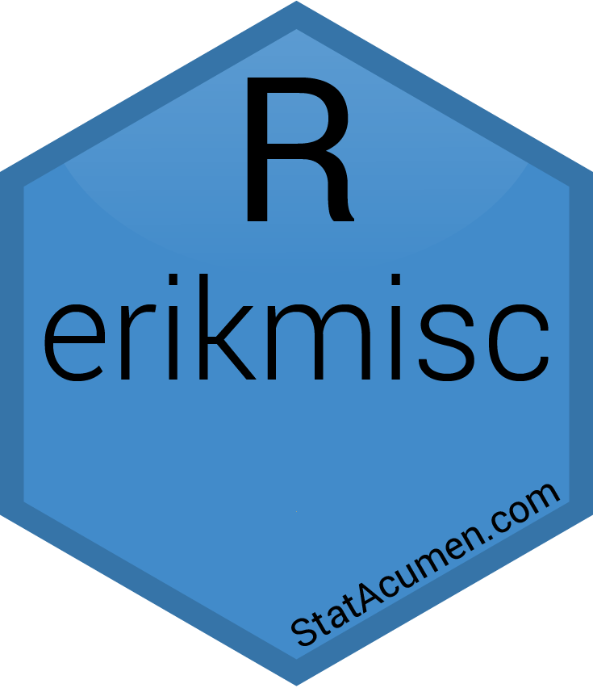

<!-- README.md is generated from README.Rmd. Please edit that file -->

```{r, include = FALSE}
knitr::opts_chunk$set(
  collapse = TRUE,
  comment = "#>",
  fig.path = "README-"
)
```

# erikmisc <a href='https://github.com/erikerhardt/erikmisc'></a>

<!-- badges: start -->
<!-- github workflows: https://github.com/r-lib/actions/tree/v2/examples -->
[](https://github.com/erikerhardt/erikmisc/actions/workflows/R-CMD-check.yaml)
<!-- badges: end -->

## Overview

Erik Erhardt's miscellaneous functions for solving complex data analysis workflows

* <strong><a href="https://erikerhardt.github.io/erikmisc/">Documentation and Vignettes</a></strong>
* <a href="https://github.com/erikerhardt/erikmisc/issues">Report Bug or Request Feature</a>

## Installation

```{r, eval = FALSE}
# The development version from GitHub
# install.packages("remotes")
remotes::install_github("erikerhardt/erikmisc")
```

## Usage

```{r example}
library(erikmisc)
erikmisc_logo()
?`erikmisc-package`
```

