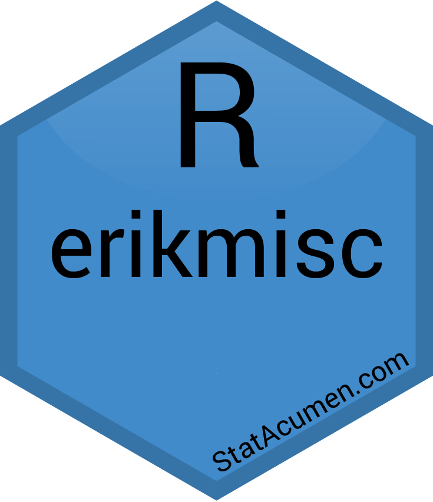

<!-- PROJECT SHIELDS -->
<!--
*** I'm using markdown "reference style" links for readability.
*** Reference links are enclosed in brackets [ ] instead of parentheses ( ).
*** See the bottom of this document for the declaration of the reference variables
*** for contributors-url, forks-url, etc. This is an optional, concise syntax you may use.
*** https://www.markdownguide.org/basic-syntax/#reference-style-links
-->
[![Contributors][contributors-shield]][contributors-url]
[![Forks][forks-shield]][forks-url]
[![Stargazers][stars-shield]][stars-url]
[![Issues][issues-shield]][issues-url]
[![MIT License][license-shield]][license-url]


<!-- PROJECT LOGO -->
<br />
<p align="center">
  <a href="https://github.com/erikerhardt/erikmisc">
    
  </a>

  <h3 align="center">erikmisc</h3>

  <p align="center">
    Erik Erhardt's miscellaneous functions for solving complex data analysis workflows.
    <br />
    <a href="https://github.com/erikerhardt/erikmisc"><strong>Explore the docs »</strong></a>
    <br />
    <br />
    <a href="https://github.com/erikerhardt/erikmisc">Vignettes</a>
    ·
    <a href="https://github.com/erikerhardt/erikmisc/issues">Report Bug</a>
    ·
    <a href="https://github.com/erikerhardt/erikmisc/issues">Request Feature</a>
  </p>
</p>


<!-- TABLE OF CONTENTS -->
<details open="open">
  <summary><h2 style="display: inline-block">Table of Contents</h2></summary>
  <ol>
    <li><a href="#installation">Installation</a></li>
    <li><a href="#usage">Usage</a></li>
    <li><a href="#license">License</a></li>
  </ol>
</details>


### Installation

You can install remotely with the following line:
```
devtools::install_github("erikerhardt/erikmisc")
```


<!-- USAGE EXAMPLES -->
## Usage

Vignettes will be written soon.

``` r
library(erikmisc)
## basic example code
```


<!-- LICENSE -->
## License

Distributed under the MIT License. See `LICENSE` for more information.


<!-- MARKDOWN LINKS & IMAGES -->
<!-- https://www.markdownguide.org/basic-syntax/#reference-style-links -->
[contributors-shield]: https://img.shields.io/github/contributors/erikerhardt/erikmisc.svg?style=for-the-badge
[contributors-url]: https://github.com/erikerhardt/erikmisc/graphs/contributors
[forks-shield]: https://img.shields.io/github/forks/erikerhardt/erikmisc.svg?style=for-the-badge
[forks-url]: https://github.com/erikerhardt/erikmisc/network/members
[stars-shield]: https://img.shields.io/github/stars/erikerhardt/erikmisc.svg?style=for-the-badge
[stars-url]: https://github.com/erikerhardt/erikmisc/stargazers
[issues-shield]: https://img.shields.io/github/issues/erikerhardt/erikmisc.svg?style=for-the-badge
[issues-url]: https://github.com/erikerhardt/erikmisc/issues
[license-shield]: https://img.shields.io/github/license/erikerhardt/erikmisc.svg?style=for-the-badge
[license-url]: https://github.com/erikerhardt/erikmisc/blob/master/LICENSE.txt
[linkedin-shield]: https://img.shields.io/badge/-LinkedIn-black.svg?style=for-the-badge&logo=linkedin&colorB=555
[linkedin-url]: https://linkedin.com/in/erikerhardt
